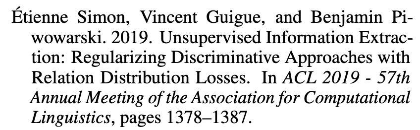

# bib-normalizer: normalize your BibTex

## Function 

1.  Capitalize the title of each ref.
2.  Remove some redundant or useless attributes. e.g., url, doi.

## Usage

Put your `.bib` file under this folder (e.g., `test.bib`), then use the following command: 

```shell
python main.py --input test.bib --output test_cap.bib
```

By default, it will only remain some attributes (e.g., author, title). Change line 17 according to your need.
## Demo

For example, there is a plain BibTex:

```bash
@inproceedings{simon:hal-02318233,
  TITLE = {Unsupervised Information Extraction: Regularizing Discriminative Approaches with Relation Distribution Losses},
  AUTHOR = {Simon, {\'E}tienne and Guigue, Vincent and Piwowarski, Benjamin},
  URL = {https://hal.archives-ouvertes.fr/hal-02318233},
  BOOKTITLE = {{ACL 2019 - 57th Annual Meeting of the Association for Computational Linguistics}},
  ADDRESS = {Florence, Italy},
  PUBLISHER = {{Association for Computational Linguistics}},
  PAGES = {1378-1387},
  YEAR = {2019},
  MONTH = Jul,
  DOI = {10.18653/v1/P19-1133},
  HAL_ID = {hal-02318233},
  HAL_VERSION = {v1},
}
```

After compiling, it looks like this below. Obviously, it not very elegant because the first letters of some words are not capitalized and there are so many redundant information, e.g., `Florence, Italy`, `10.18653/v1/P19-1133`.


A normalized BibTex should be like this:

```bash
@inproceedings{simon:hal-02318233,
  TITLE = {{U}nsupervised {I}nformation {E}xtraction: {R}egularizing {D}iscriminative {A}pproaches with {R}elation {D}istribution {L}osses},
  AUTHOR = {Simon, {\'E}tienne and Guigue, Vincent and Piwowarski, Benjamin},
  BOOKTITLE = {{ACL 2019 - 57th Annual Meeting of the Association for Computational Linguistics}},
  PAGES = {1378-1387},
  YEAR = {2019},
}
```

You can find that all words are capitalized, except for the prepositions. Some useless information has been removed. 

